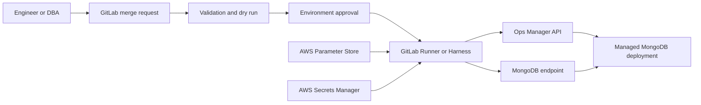

# Controlled MongoDB Changes: CI/CD with Ops Manager

## Presentation profile

- **Audience:** MongoDB technical team
- **Duration:** 30 minutes
- **Format:** Five slides followed by discussion
- **Objective:** Obtain approval for a limited DEV and SAT pilot
- **Scope:** Planned database changes, Ops Manager configuration, and controlled data corrections

The text under **Visible slide content** is the only wording intended to appear on the slide. The material under **Speaker talking material** belongs in PowerPoint speaker notes.

---

## Slide 1 — Why Change?

**Suggested time:** 4 minutes

### Visible slide content

# Why Change?

- DEV, SAT and PROD configurations differ
- Production changes can occur without review
- Application and database changes are disconnected

> **Manual capability is not controlled delivery.**

### Suggested visual layout

Use a three-environment illustration:

```text
DEV                    SAT                    PROD
Collection A           collection-a           app_collection
Index: {status: 1}     No status index         Index: {state: 1}
```

Label the differences as **configuration drift**. The examples are intentionally generic.

### Speaker talking material

We are not proposing CI/CD because the team is incapable of administering MongoDB. We are proposing it because our current process allows the same application to receive different database configurations in different environments.

We have already experienced differences in collection names and indexes between DEV, SAT and PROD. This makes testing less reliable. An application can work in DEV or SAT and behave differently in production because the database configuration tested was not the configuration deployed.

Some production changes can also begin with an informal message. A DBA may then make the change directly without peer review or independent approval. Even when the technical change is correct, the process does not reliably answer:

- What exactly was requested?
- Who reviewed it?
- Was the same change tested in a lower environment?
- Which version was deployed?
- What was the result?

The objective is not to slow down the DBA. It is to turn planned changes into a repeatable process that protects the DBA and the application team from ambiguity.

**Transition:** Ops Manager is valuable, but it addresses a different part of this problem.

---

## Slide 2 — Complementary Tools

**Suggested time:** 5 minutes

### Visible slide content

# Complementary Tools

| Ops Manager | CI/CD |
| --- | --- |
| Operate | Review |
| Monitor | Test |
| Alert | Approve |
| Troubleshoot | Promote consistently |

> **CI/CD governs changes; Ops Manager executes and monitors them.**

### Suggested visual layout

Show Ops Manager and CI/CD as two connected halves, not competing products. Place MongoDB below both.

### Speaker talking material

Ops Manager should remain the operational control plane for our self-managed MongoDB deployment. It is the correct place for runtime monitoring, alerts, backup visibility, automation status and troubleshooting.

CI/CD provides the change-delivery controls that Ops Manager is not intended to replace:

- Version-controlled definitions and scripts
- Merge-request review before execution
- Testing and dry-run results
- Environment promotion using the same commit
- Deployment approval
- Execution history linked to the exact change

For operational configuration, the pipeline does not bypass Ops Manager. It calls the supported Ops Manager API. Ops Manager and its agents continue to apply and monitor the desired configuration.

For indexes, validators and document updates, the pipeline can use a MongoDB driver or `mongosh` with a narrowly privileged service account.

Ops Manager may record that an alert or configuration changed. CI/CD adds the context that exists before execution: the proposed code, review discussion, request reference, test result and approval.

Manual Ops Manager access remains available for monitoring, investigation and emergency response. Persistent emergency changes should later be reconciled into version control.

**Transition:** The workflow covers three specific types of MongoDB changes.

---

## Slide 3 — Three Types of Changes

**Suggested time:** 6 minutes

### Visible slide content

# Three Types of Changes

### Database
Collections · Validators · Indexes

### Operations
Alerts · Users · Roles

### Data
Backfills · Corrections · Field updates

```text
Dry run → Review → Approval → Execute → Validate
```

### Suggested visual layout

Use three equal columns with a database, operations and document icon. Keep the five-step workflow as a single horizontal line beneath them.

### Speaker talking material

The first category is application-coupled database change. Examples include creating an index required by a new query, adding a validator, introducing a collection or backfilling a field required by a new application version. These changes should be coordinated with application releases because deployment order matters.

The second category is operational configuration. Examples include alert thresholds, notification settings, database users, custom roles and supported Ops Manager automation settings. These definitions can be stored as sanitized JSON or YAML and applied through the Ops Manager API. The same approved definition can then be promoted through the applicable environments.

The third category is controlled data correction. In MongoDB, adding or removing a field normally means updating matching documents with operators such as `$set` or `$unset`. Ops Manager is not the complete workflow for these one-time changes, but Python or `mongosh` scripts can execute them through CI/CD.

A production-quality data-change job must not provide an unrestricted shell. It should require:

- An exact selection filter
- A dry-run document count
- An expected and maximum affected-document count
- Peer review
- Environment approval
- Batching and timeout controls where appropriate
- Post-change validation
- A rollback or forward-fix plan

The script may be unique, but the safety workflow should be standard.

**Transition:** The same control path can deliver all three categories.

---

## Slide 4 — Controlled Workflow

**Suggested time:** 7 minutes

### Visible slide content

# Controlled Workflow

```text
Request → Git Review → Test / Dry Run → Approval
                                      ↓
                              Runner or Harness
                                      ↓
                           Ops Manager / MongoDB
```

> **Credentials are retrieved from AWS at runtime.**

### Simplified architecture diagram



### Speaker talking material

The engineer or DBA creates a feature branch containing the proposed change. The merge request provides peer review and links the implementation to the request or change record when one exists.

The pipeline first performs validation without changing the target environment. Depending on the change, this can include syntax checks, unit tests, current-state comparison, duplicate-index detection, affected-document counting and query-plan inspection.

After merge, DEV can deploy automatically. SAT should use a manual deployment approval. Production is deliberately excluded from the initial pilot.

The GitLab Runner or Harness delegate is the execution component. It does not need MongoDB credentials stored in the repository. It retrieves environment-specific connection metadata from AWS Systems Manager Parameter Store and credentials or API secrets from AWS Secrets Manager at runtime.

The execution path depends on the change:

- Ops Manager configuration goes through the Ops Manager API.
- Indexes, validators and controlled data changes go through a MongoDB driver or `mongosh`.

Use separate least-privilege identities for DEV and SAT. Serialize state-changing jobs for the same environment so two pipelines cannot modify it concurrently.

Every job should produce an execution artifact containing the commit, environment, requester, approver, timestamps, action result and validation result—without exposing credentials or sensitive document data.

**Transition:** We can prove the value without changing production.

---

## Slide 5 — DEV/SAT Pilot

**Suggested time:** 3 minutes, followed by 5 minutes of discussion

### Visible slide content

# DEV/SAT Pilot

1. Create one index
2. Configure one alert
3. Execute one controlled data update

### Success

- Same change in DEV and SAT
- Approval and execution recorded
- No credentials stored in Git

> **Decision: Approve a limited DEV/SAT pilot.**

### Suggested visual layout

Show the three pilot changes on the left and three measurable outcomes on the right. Place the decision request in a single accent-colored bar across the bottom.

### Speaker talking material

This proposal does not request immediate production automation or replacement of Ops Manager. It requests a small DEV and SAT pilot covering one example from each change category.

The first job creates an idempotent sample index. The pipeline verifies whether the equivalent index already exists before attempting creation.

The second job applies a generic alert configuration through the Ops Manager API. This demonstrates that CI/CD can govern an Ops Manager change without replacing Ops Manager.

The third job performs a controlled update against sample documents. It runs first in dry-run mode, reports the affected count, requires approval and then validates the result after execution.

The pilot succeeds if:

- DEV and SAT receive the same change from the same commit.
- SAT deployment requires and records approval.
- Credentials remain in AWS and do not appear in Git or job logs.
- Rerunning a completed job does not create a harmful duplicate action.
- The pipeline produces sufficient evidence to reconstruct what happened.

After the pilot, the team can compare this workflow with the current manual process and decide whether to expand it. Production automation would require a separate decision and appropriate production controls.

**Closing statement:** We are not automating MongoDB administration for its own sake. We are creating one controlled and repeatable path for planned changes while retaining Ops Manager for daily operations and emergency response.

---

## Anticipated technical questions

### Why not perform every change directly in Ops Manager?

Ops Manager remains appropriate for monitoring, troubleshooting and supported operational actions. CI/CD adds pre-execution review, repeatable environment promotion, application-release coordination and a versioned implementation record.

### Does this remove DBA control?

No. DBAs review database changes, define technical standards and approve higher-environment deployments. The workflow makes DBA decisions visible and repeatable.

### Must every emergency wait for a pipeline?

No. Use controlled break-glass access for incidents. Record the action and reconcile any persistent change into version control afterward.

### Why use both GitLab and Harness?

The pilot only needs one execution platform. GitLab is the simplest starting point because the code and merge-request workflow are already there. Harness can be evaluated later as an alternative deployment and approval engine.

### Is Maven or Java required?

No. The Runner or delegate can execute Python, shell, `curl` or `mongosh`. Maven is only required for a Java-based deliverable.

## Reference material

- [MongoDB Ops Manager alert configuration](https://www.mongodb.com/docs/ops-manager/current/tutorial/manage-alert-configurations/)
- [MongoDB Ops Manager alert configuration API](https://www.mongodb.com/docs/ops-manager/current/reference/api/alert-configurations/)
- [MongoDB Ops Manager Automation configuration API](https://www.mongodb.com/docs/ops-manager/current/reference/api/automation-config/)
- [GitLab protected environments](https://docs.gitlab.com/ci/environments/protected_environments/)
- [GitLab deployment approvals](https://docs.gitlab.com/ci/environments/deployment_approvals/)
- [GitLab resource groups](https://docs.gitlab.com/ci/resource_groups/)
- [GitLab external secrets](https://docs.gitlab.com/ci/secrets/)
- [Harness approvals](https://developer.harness.io/docs/platform/approvals/approvals-tutorial/)

## Sanitization notice

This presentation uses generic environments, collection names, indexes, users and infrastructure labels. It contains no real organization names, hostnames, IP addresses, database names, collection names, credentials, account identifiers or internal URLs.
