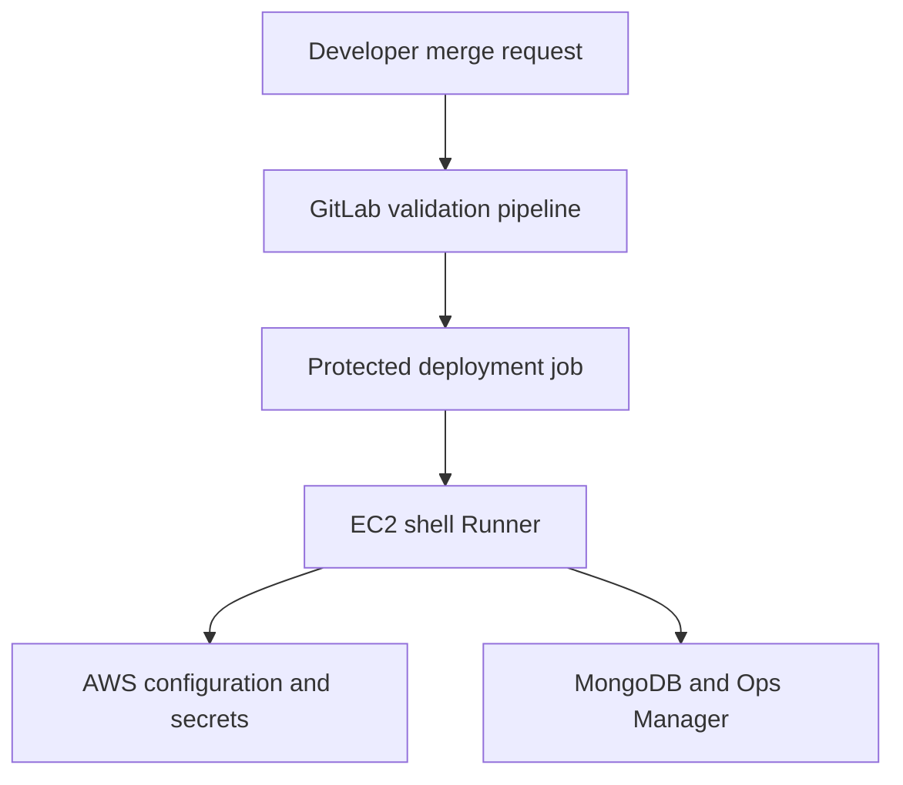

# End-to-End Workflow

The repository contains deployment intent, never runtime credentials. One
commit is promoted through DEV, SAT, and PROD.

## Request Flow

1. A developer changes an environment YAML file or an idempotent Python change.
2. A merge request runs linting, unit tests, and both dry-run commands on a
   general-purpose Runner that has no deployment access.
3. After merge, GitLab schedules `deploy_dev` on the protected Runner tagged
   `mongodb-deploy`.
4. The shell Runner receives only `DEPLOY_ENV` and nonsecret values such as
   `AWS_REGION`.
5. The EC2 instance profile supplies temporary AWS credentials automatically.
6. Python reads connection endpoints/project IDs from Parameter Store and
   credentials/API keys from Secrets Manager.
7. The database script connects to the configured MongoDB deployment and
   creates `ix_customerId` on the existing `orders` collection only if needed.
8. The Ops Manager script reads the full Automation configuration, verifies its
   version and authentication state, adds the custom collection-reader role and
   user, and writes the full configuration back.
9. SAT and PROD use the same commit and code. Their jobs require manual action;
   PROD should also require protected-environment approval.

## Environment Selection

`DEPLOY_ENV` is an allow-listed routing key, not a hostname:

| Value | Config file | Pipeline behavior |
|---|---|---|
| `dev` | `config/environments/dev.yml` | Automatic after default-branch merge |
| `sat` | `config/environments/sat.yml` | Manual promotion |
| `prod` | `config/environments/prod.yml` | Manual promotion plus approval |

No script constructs AWS paths, hostnames, or database names from arbitrary
user input. It loads only one of the three committed files.

## Database Change

The index change is idempotent:

- Missing index: create it.
- Same index name and same definition: report `unchanged`.
- Same index name but different definition: fail for human review.
- Missing collection: fail rather than create a collection accidentally.

The deployment MongoDB user therefore needs only the permissions required to
connect, inspect collections/indexes, and create the approved index in the
target database.

## Ops Manager Change

This creates a **MongoDB database user**, not an Ops Manager UI user. The custom
role grants only `find` on the configured collection.

The Ops Manager programmatic API key must have `Project Automation Admin` for
the target project. The target MongoDB deployment must already have
authentication enabled with `auth.authoritativeSet` set to `true`.

Ops Manager's update endpoint replaces the complete Automation configuration.
The sample performs a second version check immediately before the update, but
the platform does not provide general concurrent-update protection. GitLab
`resource_group` and Runner concurrency serialize this repository's jobs; the
Ops Manager administrators must still coordinate other writers.

The new user secret's `password` is sent as `initPwd` only when the user does
not exist. The script never rotates or prints an existing user's password.
Creating a new password is a sensitive-field update, so this operation must use
the full Automation endpoint rather than `/automationConfig/noSecrets`, which
ignores sensitive fields. The full configuration can itself contain secrets;
the script keeps it only in process memory and never writes or logs it.

## Failure and Recovery

- A failed job does not roll back an earlier successful operation.
- Both changes are idempotent, so rerunning the same commit is safe after
  correcting the cause.
- If the index succeeded and the Ops Manager update failed, the rerun reports
  the index unchanged and retries the user operation.
- A conflicting index, role, or user is an intentional stop condition. Review
  the live definition instead of deleting it automatically.
- Review the Ops Manager Automation status after a successful API update before
  declaring the user available.

## References

- [Ops Manager Automation Configuration API](https://www.mongodb.com/docs/ops-manager/current/reference/api/automation-config/)
- [Update one project's Automation configuration](https://www.mongodb.com/docs/ops-manager/current/reference/api/automation-config/update-automation-config/)
- [GitLab environments](https://docs.gitlab.com/ci/environments/)
- [GitLab protected environments](https://docs.gitlab.com/ci/environments/protected_environments/)
