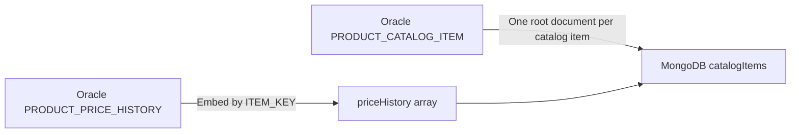

# Oracle Parent/History Tables to an Embedded MongoDB Model

_Last reviewed: July 30, 2026_

## Purpose

This teaching example documents a complete MongoDB Relational Migrator workflow for two related Oracle tables:

- `PRODUCT_CATALOG_ITEM`: the current state of a catalog item
- `PRODUCT_PRICE_HISTORY`: historical price changes for the catalog item

The target is one MongoDB collection in which each current catalog item is a root document and its price-change rows are stored in a `priceHistory` array.

All source names and infrastructure details in this guide are sanitized. Replace them with approved local values from the source data dictionary. Never place credentials, internal hostnames, or production data in a public repository.

## Target Outcome



Example MongoDB document:

```javascript
{
  _id: ObjectId("..."),
  itemKey: "ITEM-10001",
  sku: "SKU-20001",
  productName: "Example Product",
  categoryCode: "OFFICE",
  supplierKey: "SUP-30001",
  currentPrice: NumberDecimal("29.95"),
  currencyCode: "USD",
  active: true,
  createdAt: ISODate("2026-07-01T12:00:00.000Z"),
  updatedAt: ISODate("2026-07-02T14:30:00.000Z"),
  priceHistory: [
    {
      priceEventId: 501,
      previousPrice: NumberDecimal("24.95"),
      newPrice: NumberDecimal("29.95"),
      currencyCode: "USD",
      changeReason: "Annual price review",
      changeAction: "INCREASE",
      effectiveAt: ISODate("2026-07-02T00:00:00.000Z"),
      recordedAt: ISODate("2026-07-02T14:30:00.000Z")
    }
  ]
}
```

## 1. Preliminary Analysis

### 1.1 Confirm the business relationship

Establish that:

- `PRODUCT_CATALOG_ITEM.ITEM_KEY` identifies the current catalog item.
- `PRODUCT_PRICE_HISTORY.ITEM_KEY` refers to the parent catalog item.
- The relationship is one parent to zero or more history rows.
- History normally belongs to and is read with the current catalog item.
- History retention and growth will not create unbounded MongoDB documents.

Do not decide to embed solely because a foreign key exists. The application access pattern and maximum child cardinality must support embedding.

### 1.2 Collect source statistics

Run equivalent queries using the approved schema owner:

```sql
SELECT COUNT(*) AS parent_rows
FROM <SOURCE_OWNER>.PRODUCT_CATALOG_ITEM;

SELECT
    COUNT(*) AS history_rows,
    COUNT(DISTINCT ITEM_KEY) AS parents_with_history
FROM <SOURCE_OWNER>.PRODUCT_PRICE_HISTORY;

SELECT MAX(history_count) AS maximum_price_history_rows_per_item
FROM (
    SELECT ITEM_KEY, COUNT(*) AS history_count
    FROM <SOURCE_OWNER>.PRODUCT_PRICE_HISTORY
    GROUP BY ITEM_KEY
);
```

Check parent-key quality:

```sql
SELECT ITEM_KEY, COUNT(*) AS duplicate_count
FROM <SOURCE_OWNER>.PRODUCT_CATALOG_ITEM
GROUP BY ITEM_KEY
HAVING COUNT(*) > 1;

SELECT COUNT(*) AS null_item_keys
FROM <SOURCE_OWNER>.PRODUCT_CATALOG_ITEM
WHERE ITEM_KEY IS NULL;
```

Check for orphaned history:

```sql
SELECT COUNT(*) AS orphan_history_rows
FROM <SOURCE_OWNER>.PRODUCT_PRICE_HISTORY h
LEFT JOIN <SOURCE_OWNER>.PRODUCT_CATALOG_ITEM p
    ON p.ITEM_KEY = h.ITEM_KEY
WHERE p.ITEM_KEY IS NULL;
```

Embedding is reasonable when the maximum history count remains controlled and the resulting document stays well below MongoDB's 16 MiB BSON document limit. Keep history as a separate collection if it can grow indefinitely, is queried independently, or has a separate lifecycle.

### 1.3 Inspect keys, constraints, and types

Confirm:

- Whether `ITEM_KEY` is a declared primary key, a unique key, or merely unique in current data.
- The exact foreign-key relationship.
- Nullable columns.
- Oracle `NUMBER` precision and scale.
- Timestamp types and timezone semantics.
- Maximum lengths of product names, change reasons, and identifier columns.

Relational Migrator can inherit a declared single-column primary key into MongoDB `_id`. If the parent has no declared primary key, its default is an autogenerated `ObjectId`. In that case, retain `itemKey` as a separate field and create a unique MongoDB index only after proving the field is non-null and unique.

### 1.4 Run Pre-Migration Analysis

In the project, open **Pre-Migration Analysis** and select **Run analysis**.

The report can identify:

- Unsupported Oracle features
- Data-type incompatibilities
- Schema-mapping risks
- Migration-performance risks

The feature is a public preview and is advisory. It normally takes several minutes to crawl the source database.

#### If connection testing succeeds but analysis fails

A successful connection test proves basic authentication and connectivity; it does not prove that the account can read all metadata needed by the analysis.

Common causes include:

- The account reads tables owned by another schema but lacks catalog permissions.
- The project uses a generic/custom JDBC connection. Pre-Migration Analysis supports Oracle through the supported Oracle connection, not generic JDBC sources.
- Relational Migrator cannot discover cross-schema key metadata.
- The installed Relational Migrator version has a source-specific defect.

For a Linux installation, inspect:

```bash
grep -Ei 'ORA-|analysis|error|exception' \
  ~/.mongodb/relational-migrator/migrator.log | tail -100
```

If Relational Migrator runs as another operating-system account, inspect the same path under that service account's home directory. Do not include credentials or internal infrastructure details when sharing logs.

Pre-Migration Analysis is optional. If the preview feature remains unavailable, complete the manual checks in this guide and run a controlled test snapshot with verification.

## 2. Required Access

Use dedicated migration service accounts. Do not build a repeatable migration around a person's account.

### 2.1 Oracle permissions

The source user should not copy or export another schema's tables into its own schema merely to make Relational Migrator work. Copying can omit constraints, relationships, indexes, statistics, triggers, and ownership semantics.

MongoDB documents the following baseline when the Relational Migrator account owns the source tables:

```sql
GRANT CREATE SESSION TO <MIGRATOR_USER>;
GRANT SELECT ON V_$DATABASE TO <MIGRATOR_USER>;
```

When the migration account does not own the tables:

```sql
GRANT CREATE SESSION TO <MIGRATOR_USER>;
GRANT SELECT_CATALOG_ROLE TO <MIGRATOR_USER>;
GRANT SELECT ANY TABLE TO <MIGRATOR_USER>;
GRANT SELECT ON V_$DATABASE TO <MIGRATOR_USER>;
GRANT FLASHBACK ANY TABLE TO <MIGRATOR_USER>;
```

These are broad Oracle privileges. The Oracle DBA and security team must review and approve them. In a multitenant Oracle deployment, grants may require `CONTAINER=ALL`; follow the generated prerequisite script and the organization's Oracle standards.

For a narrowly scoped test, direct `SELECT` grants may be sufficient to read the two tables, but the analysis or snapshot-prerequisite check may still report missing database-level access.

### 2.2 MongoDB permissions

Create a dedicated MongoDB user with `readWrite` on the target database:

```javascript
use admin

db.createUser({
  user: "relational_migrator_writer",
  pwd: passwordPrompt(),
  roles: [
    { role: "readWrite", db: "migration_test" }
  ]
})
```

Use the organization's approved authentication mechanism and TLS settings. Do not place a password in the project name, documentation, Git, screenshots, or a connection URI stored in source control.

### 2.3 Credential handling

A saved Relational Migrator connection can be reused across projects and migration jobs. The credentials supplied for a migration job do not need to be the same credentials used when the project was created.

Recommended practice:

- Save connection metadata using a clear name such as `oracle-sat-product-catalog` or `mongodb-sat-product-catalog`.
- Add the correct environment tag.
- Enter secrets in the credential fields rather than embedding them in documentation.
- Avoid saving personal credentials on a shared Relational Migrator server.
- Prefer a controlled service account whose password lifecycle is managed through the organization's secrets process.

When **Save password** is selected, Relational Migrator stores the password securely on the machine where Relational Migrator runs. On a shared EC2 host, that machine is the server, not the administrator's browser workstation.

## 3. Build the Connections

### 3.1 Oracle source connection

1. Create or open the Relational Migrator project.
2. Select **Connect to live database**.
3. Choose the supported Oracle database type.
4. Supply the approved host, port, service name or SID, and migration-user credentials.
5. Give the connection a readable name and environment tag.
6. Test the connection.
7. Select the source schema and the two tables.
8. Refresh the schema after any privilege or source-DDL change.

If schema discovery cannot see the real cross-schema relationship, use a DDL import for modeling or create a synthetic foreign key in Relational Migrator. A live source connection is still required to move the data.

### 3.2 MongoDB destination connection

1. At the top of the project or during migration-job creation, select **Add MongoDB connection**.
2. Enter the replica-set connection string and target database.
3. Enter the dedicated migration-writer credentials.
4. Test the connection.
5. Give it a readable name and environment tag.

Use a dedicated empty test database for the first migration. Confirm the target database name before enabling any option that drops destination collections.

## 4. Create the Project and Initial Model

Recommended project naming:

```text
<application>-<domain>-oracle-to-mongodb-<environment>
```

Sanitized example:

```text
catalog-pricing-oracle-to-mongodb-sat
```

For **Initial mappings**:

1. Select **Start with a recommended MongoDB schema**.
2. Keep `PRODUCT_CATALOG_ITEM` as a top-level collection.
3. Do not create `PRODUCT_PRICE_HISTORY` as a second top-level collection when the approved design is to embed its rows.
4. Use `camelCase` for MongoDB field names.

One project can contain multiple related tables and multiple migration jobs. Do not create one project per table. Create a separate project when the tables belong to another application domain, require an unrelated document model, or target a different MongoDB database.

## 5. Create the Parent Mapping

Map `PRODUCT_CATALOG_ITEM` as new documents in:

```text
catalogItems
```

Suggested fields:

| Source column | MongoDB field | Treatment |
|---|---|---|
| `ITEM_KEY` | `itemKey` | Retain; parent/child business key |
| `SKU` | `sku` | Retain |
| `PRODUCT_NAME` | `productName` | Retain |
| `CATEGORY_CODE` | `categoryCode` | Retain |
| `SUPPLIER_KEY` | `supplierKey` | Retain |
| `CURRENT_PRICE` | `currentPrice` | Map to the approved decimal type |
| `CURRENCY_CODE` | `currencyCode` | Retain |
| `ACTIVE_FLAG` | `active` | Convert to the agreed Boolean representation |
| `CREATED_AT` | `createdAt` | Map to BSON Date |
| `UPDATED_AT` | `updatedAt` | Map to BSON Date |

### `_id` decision

- If `ITEM_KEY` is a declared, non-null, single-column Oracle primary key, consider **Single Inherited Primary Key**.
- If it is only a unique constraint or a logical key, keep the default `ObjectId` for the walkthrough and retain `itemKey`.
- Document the decision before production migration because changing `_id` later is disruptive.

## 6. Create the Embedded History Mapping

### 6.1 Confirm the relationship is available

An embedded-array mapping is enabled only when Relational Migrator recognizes the history table as the many side of a usable relationship and the parent is mapped to a collection.

If **Embedded array** is disabled:

1. Cancel the new-document mapping.
2. Refresh the relational schema after correcting Oracle metadata permissions.
3. Confirm that a relationship line appears between the tables.
4. If the source relationship remains unavailable, add a synthetic one-to-many foreign key:

```text
Parent table:  PRODUCT_CATALOG_ITEM
Parent field:  ITEM_KEY
Child table:   PRODUCT_PRICE_HISTORY
Child field:   ITEM_KEY
Cardinality:   One-to-many
```

Prefer the real Oracle constraint when it can be imported. Use a synthetic relationship only to represent a verified logical relationship that Relational Migrator cannot discover.

### 6.2 Add the embedded array

Select `PRODUCT_PRICE_HISTORY`, click **+ Add**, and configure:

```text
Migrate table as: Embedded array
Parent collection: catalogItems
Prefix: (root)
Field name: priceHistory
Foreign-key link: ITEM_KEY relationship
```

Use `priceHistory`, not an autogenerated name that repeats the full table or collection name. The parent document already supplies the context.

### 6.3 Embedded field treatment

| Source column | MongoDB field | Treatment |
|---|---|---|
| generated embedded `_id` | — | Exclude when `priceEventId` is retained |
| `PRICE_EVENT_KEY` | `priceEventId` | Retain |
| `ITEM_KEY` | — | Exclude; redundant parent join key |
| `PREVIOUS_PRICE` | `previousPrice` | Retain as historical snapshot |
| `NEW_PRICE` | `newPrice` | Retain as historical snapshot |
| `CURRENCY_CODE` | `currencyCode` | Retain |
| `CHANGE_REASON` | `changeReason` | Retain |
| `CHANGE_ACTION` | `changeAction` | Retain |
| `EFFECTIVE_AT` | `effectiveAt` | Retain |
| `RECORDED_AT` | `recordedAt` | Retain |

Repeated price and currency fields should remain in the child row when they capture the state at the time of the event. Remove them only after the application owner confirms they are redundant rather than historical snapshots.

### 6.4 Sort the history array

In the embedded-array mapping:

1. Expand **Advanced settings**.
2. Leave **Add mapping rule filter** unchecked unless a real filtering requirement exists.
3. Select **Add array conditions**.
4. Configure:

```text
Sort by: RECORDED_AT
Order: Ascending
Limit: No limit
```

Keep the sort field included in the mapping. Excluded fields cannot be used for array sorting.

### 6.5 Handle Oracle `TIMESTAMP(6)`

MongoDB BSON Date stores millisecond precision, while Oracle `TIMESTAMP(6)` can store microseconds. Mapping to BSON Date may lose the final three fractional-second digits.

Use BSON Date when millisecond precision is sufficient and add a mapping note:

```text
Oracle TIMESTAMP(6) has microsecond precision. BSON Date preserves
millisecond precision; sub-millisecond digits may be truncated.
Use priceEventId as a secondary ordering key.
```

If exact microsecond fidelity is required, use a supported String or Long conversion strategy and document how the application will query and compare that representation. Relational Migrator 1.16 added Oracle timestamp conversion options and full-precision String conversions.

## 7. Review the Generated Model

Open **JSON Schema** and review the sample document.

Confirm:

- There is one root collection.
- `priceHistory` is an array under the root document.
- The embedded row does not repeat `itemKey`.
- The embedded row does not contain an unnecessary generated `_id`.
- Oracle numbers map to intentional BSON numeric types.
- Timestamps use the approved precision strategy.
- Null-handling choices match application requirements.
- Names are readable and follow the chosen casing convention.

The generated sample typically contains one history element. It proves the shape, not the sort order. Confirm sorting after migrating a parent that has multiple history rows.

## 8. Run the Snapshot Migration

### 8.1 Understand the prerequisite warning

The migration-job wizard may report:

> The source database is not configured for running snapshot migration jobs.

This means Relational Migrator detected missing Oracle configuration or privileges. A successful connection test does not override this warning.

Select **Generate script**, then:

1. Save the generated SQL script.
2. Review every statement.
3. Have the Oracle DBA approve and execute only the required statements using the appropriate privileged account.
4. Regenerate or rerun the prerequisite check.

Do not execute a generated database-configuration script blindly, especially against a shared or production Oracle database.

### 8.2 Recommended first-test options

```text
Mode: Snapshot
Drop destination collections: Yes, only for a disposable test database
Stop migration after: 1 error
Verify migrated data: Yes
```

The drop option deletes the existing destination collections before loading. Never use it against data that must be retained.

Snapshot jobs are non-idempotent by default and can insert duplicates when rerun. For repeatable disposable tests, start with an empty target or drop the test collection. Relational Migrator can enable idempotency through `user.properties`, but MongoDB warns that this can materially affect performance on large jobs.

### 8.3 Start and monitor

1. Review source and destination connection names.
2. Confirm the target database is the test database.
3. Confirm the selected collection and migration options.
4. Start the job.
5. Monitor the snapshot, transformation, write, cleanup, and verification stages.
6. Download the job log if any row or mapping fails.

For a Linux installation, the application log is:

```text
~/.mongodb/relational-migrator/migrator.log
```

## 9. Validate the Result

Built-in verification should be enabled, but also perform model-specific checks.

### 9.1 Root-document count

The MongoDB root-document count should equal the valid parent-row count:

```javascript
db.catalogItems.countDocuments()
```

### 9.2 Total embedded-history count

The total number of embedded elements should equal the valid, joined history-row count:

```javascript
db.catalogItems.aggregate([
  {
    $project: {
      historyCount: { $size: { $ifNull: ["$priceHistory", []] } }
    }
  },
  {
    $group: {
      _id: null,
      totalHistoryRows: { $sum: "$historyCount" }
    }
  }
])
```

### 9.3 Check chronological ordering

Inspect parents with multiple history entries:

```javascript
db.catalogItems.find(
  { "priceHistory.1": { $exists: true } },
  { itemKey: 1, priceHistory: 1 }
).limit(10)
```

If timestamp values can collide after microsecond-to-millisecond conversion, use `priceEventId` as a deterministic secondary ordering key in application logic.

### 9.4 Validate representative records

Compare sampled records across Oracle and MongoDB for:

- Parent identifiers
- SKU, category, and supplier fields
- Price, currency, and change-reason values
- Null handling
- Timestamp precision and timezone interpretation
- History element count and order
- Non-ASCII and maximum-length strings

### 9.5 Add application indexes

After confirming uniqueness, consider:

```javascript
db.catalogItems.createIndex(
  { itemKey: 1 },
  { unique: true, name: "uq_itemKey" }
)
```

Create other indexes from verified application query patterns, not solely from the indexes that existed in Oracle.

## 10. Snapshot Versus CDC

### Snapshot

A snapshot is a bounded, one-time migration of source data. It does not continue applying Oracle inserts, updates, and deletes after the snapshot boundary.

Snapshot is appropriate for:

- Modeling and test migrations
- One-time loads
- Cutovers with an approved write freeze
- Migrations with a separately engineered delta process

### Why Continuous/CDC is disabled

The screen label is **MongoDB AMP**, not APM.

**AMP** means **Application Modernization Platform**. It combines MongoDB modernization tooling, a delivery framework, and MongoDB delivery engineers. It is different from application performance monitoring, which is commonly abbreviated APM.

Beginning with Relational Migrator 1.15, released October 17, 2025, MongoDB moved Continuous Sync (CDC) out of the standalone Relational Migrator product. It is now available only as part of an AMP engagement. Therefore:

- The disabled Continuous option is not caused by the Oracle user.
- It is not caused by the MongoDB user's roles.
- It cannot be enabled through a local checkbox or normal `user.properties` setting.
- Upgrading the standalone tool does not unlock CDC.

An **AMP engagement** is a scoped modernization engagement with MongoDB's account and delivery teams. It is not simply a feature flag, community download, or separately documented self-service CDC plug-in. MongoDB publicly describes AMP as a combination of platform tooling, a delivery framework, and delivery engineers. The account team determines access, commercial scope, deployment components, and implementation responsibilities.

To pursue CDC through Relational Migrator:

1. Contact the organization's MongoDB account representative.
2. Request an **AMP assessment for Oracle-to-MongoDB Continuous Sync (CDC)**.
3. Provide the Oracle version and topology, data volume and change rate, downtime target, MongoDB target type, document mappings, and network/security constraints.
4. Confirm support for the target deployment, including self-managed MongoDB where applicable.
5. Obtain the AMP-specific tooling/access, deployment plan, Oracle logging and privilege requirements, monitoring, recovery, validation, and cutover procedure.
6. Test CDC correctness for embedded arrays before production cutover.

For regulated or isolated environments, confirm early whether AMP delivery and connectivity satisfy organizational requirements.

### If AMP is not available

Choose an explicit alternative:

- Controlled application write freeze, final snapshot, validation, and cutover
- Oracle-aware CDC through an approved product such as Oracle GoldenGate
- Debezium Oracle plus Kafka and an engineered MongoDB sink or consumer
- AWS Database Migration Service when available and approved
- A custom timestamp/sequence-based delta process when deletes and transaction ordering are not required

AWS Glue JDBC bookmarks are incremental batch processing, not complete Oracle redo-log CDC. They do not automatically capture arbitrary updates, deletes, or transaction order.

## 11. Errors and Warnings Encountered in This Workflow

| Symptom | Meaning | Response |
|---|---|---|
| Connection test succeeds; Pre-Migration Analysis fails unexpectedly | Basic table access works, but metadata access, connector support, or preview analysis fails | Inspect `migrator.log`; verify Oracle connector and catalog access; continue with manual analysis if necessary |
| Embedded array option is disabled | Relational Migrator does not recognize an eligible one-to-many relationship | Refresh schema after permissions; import relationship metadata or add a verified synthetic foreign key |
| `TIMESTAMP(6)` to BSON Date truncation warning | Oracle microseconds exceed BSON Date millisecond precision | Accept and document, or map to a full-precision String/Long representation |
| Snapshot source-configuration warning | Required Oracle privileges or configuration are missing | Generate the SQL script and have the Oracle DBA review and apply approved statements |
| Continuous option is unavailable | Standalone Relational Migrator 1.15+ no longer includes CDC | Engage MongoDB AMP or select another approved CDC/cutover strategy |

## 12. Completion Checklist

- [ ] Parent and history ownership confirmed
- [ ] Parent key is unique and non-null
- [ ] Foreign key and orphan count reviewed
- [ ] Maximum history cardinality measured
- [ ] Document-size growth assessed
- [ ] Oracle migration account approved
- [ ] MongoDB migration writer approved
- [ ] Connections named and tagged by environment
- [ ] Parent mapped to one top-level collection
- [ ] History mapped as `history` embedded array
- [ ] Redundant embedded `_id` and parent join key excluded
- [ ] Historical snapshot fields retained intentionally
- [ ] Timestamp precision decision documented
- [ ] Array sorted ascending with no unintended limit
- [ ] JSON Schema and sample document reviewed
- [ ] Generated Oracle prerequisite script reviewed by DBA
- [ ] First snapshot targets a disposable database
- [ ] Error threshold and built-in verification enabled
- [ ] Counts, field values, history ordering, and nulls reconciled
- [ ] CDC/AMP or controlled-cutover strategy documented
- [ ] Project export, logs, and validation evidence retained

## Official References

- [Relational Migrator overview](https://www.mongodb.com/docs/relational-migrator/getting-started/)
- [Pre-Migration Analysis](https://www.mongodb.com/docs/relational-migrator/app-analysis/)
- [Run Pre-Migration Analysis](https://www.mongodb.com/docs/relational-migrator/app-analysis/run-analysis/)
- [Manage the relational model](https://www.mongodb.com/docs/relational-migrator/projects/manage-relational-connection/)
- [Project settings and key handling](https://www.mongodb.com/docs/relational-migrator/projects/configure-settings/)
- [Embedded array mapping](https://www.mongodb.com/docs/relational-migrator/mapping-rules/mapping-rule-options/embedded-array/)
- [Synthetic foreign keys](https://www.mongodb.com/docs/relational-migrator/mapping-rules/synthetic-foreign-key/add-foreign-key/)
- [Create a migration job](https://www.mongodb.com/docs/relational-migrator/jobs/creating-jobs/)
- [Data migration behavior](https://www.mongodb.com/docs/relational-migrator/jobs/sync-jobs/)
- [Data verification](https://www.mongodb.com/docs/relational-migrator/jobs/data-verification/)
- [Oracle migration prerequisites](https://www.mongodb.com/docs/relational-migrator/jobs/prerequisites/oracle/)
- [Manage saved connections](https://www.mongodb.com/docs/relational-migrator/database-connections/manage-database-connections/)
- [Relational Migrator release notes](https://www.mongodb.com/docs/relational-migrator/release-notes/)
- [MongoDB Application Modernization Platform](https://www.mongodb.com/products/updates/mongodb-application-modernization-platform-amp-now-available/)

## Disclaimer

This is a sanitized teaching example. It is not a production migration authorization, security standard, or substitute for application-owner, Oracle DBA, MongoDB DBA, architecture, and change-management approval.
