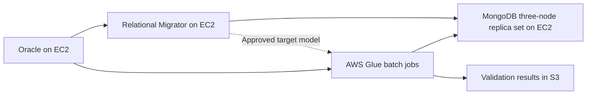

# MongoDB Relational Migrator vs. AWS Glue for Oracle-to-MongoDB Migration

_Last reviewed: July 26, 2026_

## Purpose

Compare MongoDB Relational Migrator and AWS Glue for migrating an Oracle workload to a self-managed MongoDB Enterprise three-node replica set on Amazon EC2.

## Assumed Architecture

- Oracle database runs on self-managed Amazon EC2.
- MongoDB Enterprise runs as a self-managed three-node replica set on EC2.
- MongoDB Relational Migrator can run on a dedicated EC2 instance in the same or a connected VPC.
- AWS Glue jobs connect privately to Oracle and MongoDB through VPC networking.
- The target data model may include both direct table-to-collection mappings and denormalized documents assembled from multiple Oracle tables.
- This document addresses data movement and transformation. Application remediation, stored-procedure replacement, security approval, backup, and cutover governance are separate workstreams.

## Executive Recommendation

Use **MongoDB Relational Migrator as the primary tool for schema discovery, document-model design, and initial snapshot migration**, especially for small-to-medium workloads and mappings that depend on Oracle primary-key and foreign-key relationships.

Use **AWS Glue selectively** when the migration requires large-scale distributed processing, complex PySpark transformations, S3 staging, reusable code-based pipelines, or independent reconciliation and data-quality processing.

For this architecture, the strongest combined approach is usually:

1. Design and validate the MongoDB document model in Relational Migrator.
2. Use Relational Migrator for straightforward snapshot loads.
3. Use Glue for complex or very large data domains and for validation/reconciliation.
4. Assign each collection or migration phase to one writer. Do not let Relational Migrator and Glue load the same target collections concurrently.

Neither tool, by itself, should be treated as a complete Oracle log-based change data capture (CDC) solution. Current Relational Migrator documentation describes snapshot migration jobs, while Glue job bookmarks provide incremental batch processing—not Oracle redo-log capture. A low-downtime migration that must capture inserts, updates, and deletes after the initial load requires a separate CDC mechanism.

## Side-by-Side Comparison

| Area | MongoDB Relational Migrator | AWS Glue |
|---|---|---|
| Primary purpose | Relational-to-MongoDB schema design and migration | General-purpose managed ETL and distributed data processing |
| Oracle source | Supported directly through JDBC | Supported through JDBC; custom driver versions can also be supplied from S3 |
| Self-managed MongoDB target | Explicitly supported | Supported as a MongoDB target through an AWS Glue connection |
| Document-model design | Strong: visual ERD, recommended mappings, field mapping, embedding, merging, calculated fields, filters, and `_id` choices | Manual: document structure, joins, nesting, arrays, type conversions, and `_id` logic must be implemented in Spark/Python code |
| Initial full load | Purpose-built snapshot migration jobs | Custom batch ETL job |
| Incremental processing | Snapshot jobs can be filtered or rerun, but current supported job model is snapshot-based | Job bookmarks can track rows using monotonic JDBC keys; this is incremental batch processing, not full CDC |
| Updates and deletes after snapshot | Not a complete log-based CDC solution | Must be explicitly detected and coded; bookmarks alone do not capture arbitrary updates and deletes |
| Transformation flexibility | High for common relational-to-document mapping patterns | Very high; arbitrary PySpark/Spark SQL logic and multi-source enrichment are possible |
| Scale-out processing | Runs on the provisioned Relational Migrator host; large jobs may be split with filters | Managed distributed Spark compute; better suited to heavy parallel transformation workloads |
| Operational overhead | Install, size, patch, monitor, and recover the EC2-hosted application; unattended installation is not highly available | AWS manages the Spark service, but the team owns IAM, VPC connections, job configuration, retries, logs, and cost controls |
| Repeatability and CI/CD | Projects and REST API provide automation options, but the workflow is more tool/project oriented | Strong code-first model for Git versioning, automated tests, deployment pipelines, parameters, and scheduled reruns |
| Validation | Built-in migration verification and model-oriented inspection | Custom reconciliation plus optional AWS Glue Data Quality rules |
| Cost model | Relational Migrator is free; EC2, storage, and operational costs remain | Usage-based AWS Glue job and related AWS service charges |
| Best fit | Faster migration with significant schema redesign and moderate transformation complexity | Large-volume or highly customized ETL requiring code, distributed processing, staging, enrichment, or reusable pipelines |

## MongoDB Relational Migrator

### Advantages

- **Purpose-built relational-to-document modeling.** It derives the Oracle relational model and provides visual mapping rules for collections, embedded documents, arrays, merged tables, calculated fields, filters, and field renaming.
- **Reduces custom migration code.** Common foreign-key-driven transformations can be configured instead of implemented and maintained in PySpark.
- **Supports the actual target architecture.** MongoDB documents state that Relational Migrator can migrate to Atlas or a self-managed MongoDB deployment.
- **Faster design feedback.** Teams can inspect source and proposed target diagrams, generate sample documents, and refine the document model before the full load.
- **Selective migration.** Tables and collections can be migrated in logical groups, and filters can split large migrations into batches.
- **Migration-specific verification.** The migration job workflow includes verification aligned with the configured mapping model.
- **Lower AWS service dependency.** It can operate directly between Oracle and MongoDB over private network paths without requiring Glue, the Glue Data Catalog, or S3 staging.
- **API automation is available.** The REST API can manage migration jobs from scripts or a CI/CD workflow.

### Disadvantages

- **Snapshot-oriented.** Current detailed MongoDB documentation lists snapshot migration jobs; it should not be assumed to provide complete Oracle redo-log CDC for a low-downtime cutover.
- **Single-host operational dependency.** An unattended server installation is suitable for production migrations but is not highly available. Host or application failure can require manual intervention.
- **Scaling is host-bound.** CPU, memory, disk, and network throughput depend on the EC2 instance running Relational Migrator. Very large migrations may require workload partitioning and careful sizing.
- **Rerun behavior requires planning.** Migration jobs are non-idempotent by default. Relational Migrator can enable idempotency, but MongoDB warns that it may materially affect performance on large jobs.
- **Less flexible than custom Spark.** Highly specialized business rules, external enrichment, unusual data cleansing, or multi-stage transformations may become awkward or exceed the intended mapping model.
- **Separate operational stack.** The team must install, configure TLS, patch, monitor, back up project data, manage JDBC drivers, and protect access to the Relational Migrator service.

## AWS Glue

### Advantages

- **Distributed transformation capacity.** Glue can parallelize large Oracle extracts and complex transformations through managed Apache Spark jobs.
- **Maximum transformation flexibility.** PySpark or Spark SQL can implement custom joins, aggregations, cleansing, enrichment, type conversion, nested documents, arrays, and deterministic `_id` generation.
- **Code-first repeatability.** Jobs, configuration, mappings, validation rules, and deployment artifacts can be stored in Git and promoted through CI/CD.
- **Useful AWS integrations.** Glue works naturally with S3 staging, Secrets Manager, CloudWatch, the Data Catalog, triggers, workflows, and Glue Data Quality.
- **Direct connectivity is possible.** Glue supports Oracle JDBC and can write to MongoDB. A self-managed MongoDB deployment in a VPC can be reached through an appropriately configured Glue connection, subnet, and security group.
- **Good for independent verification.** Glue can read Oracle and MongoDB, calculate counts and aggregates, compare business keys, and write reconciliation results to S3 for review.
- **Better fit for reusable enterprise ETL.** If the organization already operates Glue pipelines, its IAM, logging, scheduling, tagging, and cost-governance patterns may be reusable.

### Disadvantages

- **No relational-to-document modeling assistant.** Glue does not infer the intended MongoDB access pattern or decide when to embed, reference, merge, or duplicate data. The team must design and code the target model.
- **More engineering effort.** Every nested-document rule, `_id` rule, join, type conversion, retry, deduplication rule, error path, and reconciliation check becomes custom pipeline logic.
- **Incremental is not the same as CDC.** JDBC bookmarks identify new rows through monotonic keys. They do not, by themselves, capture all Oracle updates and deletes or preserve transaction order.
- **Glue streaming does not capture Oracle changes directly.** Glue streaming jobs consume sources such as Kinesis or Kafka; another component must first publish Oracle changes to that stream.
- **Target-write semantics require design.** Idempotency, upsert behavior, duplicate prevention, partial reruns, write concern, partition sizing, and collection ownership must be explicitly implemented and tested.
- **Network and IAM complexity.** Private subnet routing, security groups, Secrets Manager permissions, Glue service-role permissions, S3 access, logging, and endpoint/NAT requirements must be coordinated.
- **Potential source and target pressure.** Aggressive JDBC partitioning can overload Oracle, while excessive Spark write parallelism can saturate the MongoDB primary or create replication lag.
- **Variable cost and startup overhead.** Repeated development runs, large worker configurations, staging, cataloging, and data-quality jobs can cost more than a dedicated migration host for a bounded migration.

## Using Both Together

### Pattern 1: Relational Migrator for Design; Glue for Selected Bulk Loads

Use Relational Migrator to discover relationships, design collections, test embedding decisions, generate sample documents, and establish `_id` and field mappings. Translate the approved design into PySpark only for data domains whose volume or transformation complexity justifies Glue.

**Advantages**

- Keeps MongoDB schema design explicit and visual.
- Uses Glue's distributed processing only where it adds value.
- Allows simple and medium-sized domains to remain low-code.

**Caution**

Relational Migrator mappings are not automatically executable Glue code. The implementation must preserve the approved model, key rules, filters, null handling, and type conversions.

### Pattern 2: Relational Migrator for Migration; Glue for Validation

Relational Migrator performs the snapshot migration. Glue independently compares Oracle and MongoDB using row/document counts, business-key coverage, sums, min/max dates, null rates, orphan checks, and sampled field-level hashes.

**Advantages**

- Separates data movement from validation.
- Provides auditable reconciliation results.
- Avoids two tools writing to the same collections.

This is the lowest-risk combined pattern for small-to-medium migrations.

### Pattern 3: Glue Preprocessing; Relational Migrator Final Mapping

Glue cleans or consolidates difficult Oracle data into controlled relational staging tables. Relational Migrator then maps those staging tables into the final MongoDB document model.

**Advantages**

- Keeps complicated cleansing outside the final mapping project.
- Retains Relational Migrator's visual document-model workflow.

**Trade-off**

This introduces a staging layer, additional storage, more reconciliation boundaries, and another recovery point. Relational Migrator does not directly use S3 files as its relational source, so staging must remain JDBC-accessible.

### Pattern 4: Split by Data Domain

Use Relational Migrator for straightforward or relationship-driven domains and Glue for high-volume or unusually complex domains.

Required controls:

- One authoritative writer per target collection.
- Shared deterministic `_id` rules.
- Documented collection dependencies and load order.
- Consistent Oracle snapshot boundary or extract timestamp.
- Common retry, rerun, and reconciliation standards.
- Explicit throttling based on MongoDB primary capacity and secondary replication lag.

## Recommended Architecture for This Use Case

Recommended operating model:

- **Relational Migrator owns** schema discovery, document-model design, sample migration, and straightforward snapshot loads.
- **Glue owns** only the explicitly assigned complex or high-volume collections and independent reconciliation jobs.
- **MongoDB primary capacity controls concurrency.** Initial loading should be throttled and replication lag monitored across the two secondaries.
- **Cutover CDC is a separate decision.** If the business requires continued Oracle writes after the snapshot begins, add a log-based CDC component or accept a controlled write freeze and final delta process.

## Decision Rules

Choose **Relational Migrator only** when:

- The workload is small to medium.
- The main challenge is relational-to-document modeling.
- Transformations fit Relational Migrator mapping rules.
- A snapshot plus controlled downtime or separately managed delta process is acceptable.

Choose **Glue only** when:

- The target model is already approved and fully specified.
- The team can own production-quality PySpark migration code.
- Data volume or transformation complexity needs distributed Spark.
- Reusable AWS-native ETL is more important than a migration-specific modeling interface.

Choose **both** when:

- Relational Migrator materially improves model design, but some domains require Glue scale or custom logic.
- Independent Glue-based reconciliation is required.
- A clear ownership boundary prevents both tools from writing the same collections.

## Final Position

For this self-managed EC2-to-EC2 migration, AWS Glue is not a direct functional replacement for MongoDB Relational Migrator. Relational Migrator is the better primary tool for converting the Oracle relational model into an application-oriented MongoDB document model. Glue is the stronger supporting tool for distributed custom transformation, preprocessing, and reconciliation.

The preferred baseline is therefore **Relational Migrator first, Glue where justified**, with a separate design for true CDC if low-downtime synchronization is required.

## Official References

### MongoDB

- [Relational Migrator overview](https://www.mongodb.com/docs/relational-migrator/getting-started/)
- [Relational Migrator data modeling](https://www.mongodb.com/docs/relational-migrator/mapping-rules/introduction/)
- [Relational Migrator migration jobs](https://www.mongodb.com/docs/relational-migrator/jobs/sync-jobs/)
- [Relational Migrator installation and deployment considerations](https://www.mongodb.com/docs/relational-migrator/installation/)
- [Relational Migrator REST API](https://www.mongodb.com/docs/relational-migrator/api-docs/)
- [Relational Migrator migration benchmarks](https://www.mongodb.com/docs/relational-migrator/benchmarks/)

### AWS

- [How AWS Glue works](https://docs.aws.amazon.com/glue/latest/dg/how-it-works.html)
- [AWS Glue JDBC connections](https://docs.aws.amazon.com/glue/latest/dg/aws-glue-programming-etl-connect-jdbc-home.html)
- [AWS Glue custom JDBC drivers and Oracle support](https://docs.aws.amazon.com/glue/latest/dg/console-connections-jdbc-drivers.html)
- [AWS Glue MongoDB connections](https://docs.aws.amazon.com/glue/latest/dg/aws-glue-programming-etl-connect-mongodb-home.html)
- [AWS Glue job bookmarks](https://docs.aws.amazon.com/glue/latest/dg/programming-etl-connect-bookmarks.html)
- [AWS Glue streaming concepts](https://docs.aws.amazon.com/glue/latest/dg/glue-streaming-concepts.html)
- [AWS Glue Data Quality](https://docs.aws.amazon.com/glue/latest/dg/glue-data-quality.html)
